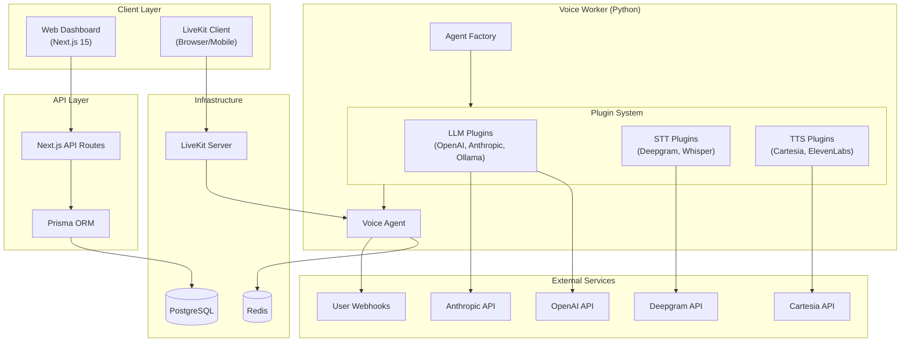

# VoxNexus

**The WordPress for AI Voice Agents**

VoxNexus is an open-source platform for building, deploying, and managing AI-powered voice agents. It provides a modular, extensible architecture that allows developers to easily swap providers, add custom plugins, and self-host their own voice AI infrastructure.

[](LICENSE)
[](CONTRIBUTING.md)

---

## Features

- **Plugin Architecture** - Swap LLM, STT, and TTS providers with a single environment variable
- **Multi-Tenancy** - Built-in support for organizations, users, and API keys
- **Webhook Integration** - Connect your own APIs for custom tool calling
- **Real-Time Voice** - LiveKit integration for low-latency voice conversations
- **Admin Dashboard** - Next.js-based UI for managing agents and monitoring usage
- **Self-Hostable** - Run everything with Docker Compose

---

## Quick Start

### Prerequisites

- [Node.js 20+](https://nodejs.org/)
- [Python 3.11+](https://python.org/)
- [Docker](https://docker.com/)
- [pnpm](https://pnpm.io/) (will be installed automatically)

### Installation

```bash
# Clone the repository
git clone https://github.com/your-org/voxnexus.git
cd voxnexus

# Install dependencies
make setup

# Copy environment template
make env

# Edit .env with your API keys
nano .env

# Start the database
make db

# Run the development servers
make dev
```

The dashboard will be available at `http://localhost:3000` and the worker health endpoint at `http://localhost:8081/health`.

---

## Architecture



### Project Structure

```
voxnexus/
├── apps/
│   ├── web/                 # Next.js 15 Admin Dashboard
│   │   ├── app/             # App Router pages
│   │   ├── components/      # React components
│   │   └── lib/             # Utilities
│   │
│   ├── worker/              # Python Voice Worker
│   │   ├── core/            # Core interfaces & types
│   │   │   └── interfaces.py  # Plugin ABCs
│   │   ├── plugins/         # Provider implementations
│   │   │   ├── llm/         # LLM plugins
│   │   │   ├── stt/         # STT plugins
│   │   │   └── tts/         # TTS plugins
│   │   └── main.py          # Entry point & factory
│   │
│   └── docs/                # Documentation site
│
├── packages/
│   ├── db/                  # Prisma schema & client
│   │   └── prisma/
│   │       └── schema.prisma
│   └── sdk/                 # Shared TypeScript types
│
├── docker-compose.yml       # Local development stack
├── Makefile                 # Developer automation
└── .env.example             # Environment template
```

---

## Configuration

### Environment Variables

Copy `.env.example` to `.env` and configure the following:

| Variable | Description | Required |
|----------|-------------|----------|
| `DATABASE_URL` | PostgreSQL connection string | Yes |
| `REDIS_URL` | Redis connection string | Yes |
| `LIVEKIT_URL` | LiveKit server URL | Yes |
| `LIVEKIT_API_KEY` | LiveKit API key | Yes |
| `LIVEKIT_API_SECRET` | LiveKit API secret | Yes |
| `LLM_PROVIDER` | Default LLM provider (openai, anthropic, ollama) | No |
| `OPENAI_API_KEY` | OpenAI API key | If using OpenAI |
| `ANTHROPIC_API_KEY` | Anthropic API key | If using Anthropic |
| `STT_PROVIDER` | Default STT provider (deepgram, whisper) | No |
| `DEEPGRAM_API_KEY` | Deepgram API key | If using Deepgram |
| `TTS_PROVIDER` | Default TTS provider (cartesia, elevenlabs, openai) | No |
| `CARTESIA_API_KEY` | Cartesia API key | If using Cartesia |

---

## Plugin Development

VoxNexus uses a Strategy Pattern for extensibility. Create custom plugins by implementing the base interfaces.

### Creating an LLM Plugin

```python
# apps/worker/plugins/llm/my_provider.py

from core.interfaces import BaseLLM, LLMConfig, Message
from main import register_plugin

@register_plugin("llm", "my_provider")
class MyProviderLLM(BaseLLM):
    """Custom LLM implementation."""

    @property
    def provider_name(self) -> str:
        return "my_provider"

    async def generate(self, messages: list[Message], **kwargs):
        # Your implementation here
        async for chunk in my_api.stream_chat(messages):
            yield chunk

    async def generate_with_tools(self, messages, tools, **kwargs):
        # Tool calling implementation
        pass
```

### Creating an STT Plugin

```python
# apps/worker/plugins/stt/my_stt.py

from core.interfaces import BaseSTT, STTConfig, TranscriptionResult
from main import register_plugin

@register_plugin("stt", "my_stt")
class MySTT(BaseSTT):
    """Custom Speech-to-Text implementation."""

    @property
    def provider_name(self) -> str:
        return "my_stt"

    async def transcribe(self, audio: bytes, **kwargs) -> TranscriptionResult:
        result = await my_api.transcribe(audio)
        return TranscriptionResult(
            text=result.text,
            confidence=result.confidence,
        )

    async def stream_transcribe(self, audio_stream, **kwargs):
        # Streaming implementation
        pass
```

### Creating a TTS Plugin

```python
# apps/worker/plugins/tts/my_tts.py

from core.interfaces import BaseTTS, TTSConfig, SynthesisResult
from main import register_plugin

@register_plugin("tts", "my_tts")
class MyTTS(BaseTTS):
    """Custom Text-to-Speech implementation."""

    @property
    def provider_name(self) -> str:
        return "my_tts"

    async def synthesize(self, text: str, **kwargs) -> SynthesisResult:
        audio = await my_api.synthesize(text)
        return SynthesisResult(audio=audio)

    async def stream_synthesize(self, text_stream, **kwargs):
        # Streaming implementation
        pass
```

---

## API Reference

### Agent Configuration Schema

Agents are configured via JSON stored in the database:

```json
{
  "id": "agent-uuid",
  "name": "Customer Support Agent",
  "llm_config": {
    "provider": "openai",
    "model": "gpt-4o",
    "temperature": 0.7,
    "system_prompt": "You are a helpful customer support agent..."
  },
  "stt_config": {
    "provider": "deepgram",
    "model": "nova-2",
    "language": "en"
  },
  "tts_config": {
    "provider": "cartesia",
    "model": "sonic-english",
    "voice_id": "professional-female"
  },
  "webhooks": {
    "lookup_order": {
      "url": "https://api.mystore.com/orders/lookup",
      "method": "POST"
    }
  }
}
```

### Health Check Endpoint

```bash
curl http://localhost:8081/health
```

```json
{
  "status": "healthy",
  "version": "0.1.0",
  "providers": {
    "llm": ["openai", "anthropic", "ollama"],
    "stt": ["deepgram", "whisper"],
    "tts": ["cartesia", "elevenlabs", "openai"]
  }
}
```

---

## Development

### Make Commands

| Command | Description |
|---------|-------------|
| `make setup` | Install all dependencies |
| `make dev` | Run full stack in development mode |
| `make db` | Start database & run migrations |
| `make test` | Run all tests |
| `make lint` | Run linters |
| `make format` | Format code |
| `make clean` | Clean up artifacts |

### Running Tests

```bash
# All tests
make test

# Web tests only
make test-web

# Worker tests only
make test-worker

# E2E tests
make test-e2e
```

---

## Deployment

### Docker Compose (Self-Hosted)

```bash
# Build production images
docker compose -f docker-compose.yml -f docker-compose.prod.yml build

# Start all services
docker compose -f docker-compose.yml -f docker-compose.prod.yml up -d
```

### Environment Requirements

- PostgreSQL 14+
- Redis 7+
- LiveKit Server (self-hosted or cloud)

---

## Contributing

We welcome contributions! Please see [CONTRIBUTING.md](CONTRIBUTING.md) for guidelines.

### Development Process

1. Fork the repository
2. Create a feature branch (`git checkout -b feature/amazing-feature`)
3. Make your changes
4. Run tests (`make test`)
5. Run linters (`make lint`)
6. Commit your changes (`git commit -m 'Add amazing feature'`)
7. Push to the branch (`git push origin feature/amazing-feature`)
8. Open a Pull Request

### Writing New Plugins

1. Create a new file in the appropriate `plugins/` directory
2. Implement the required interface (`BaseLLM`, `BaseSTT`, or `BaseTTS`)
3. Use the `@register_plugin` decorator to register your plugin
4. Add tests for your plugin
5. Update documentation

---

## License

This project is licensed under the MIT License - see the [LICENSE](LICENSE) file for details.

---

## Acknowledgments

- [LiveKit](https://livekit.io/) for real-time communication infrastructure
- [Prisma](https://prisma.io/) for database tooling
- [Next.js](https://nextjs.org/) for the web framework

---

## Support

- [GitHub Issues](https://github.com/your-org/voxnexus/issues) for bug reports and feature requests
- [Discussions](https://github.com/your-org/voxnexus/discussions) for questions and community support
